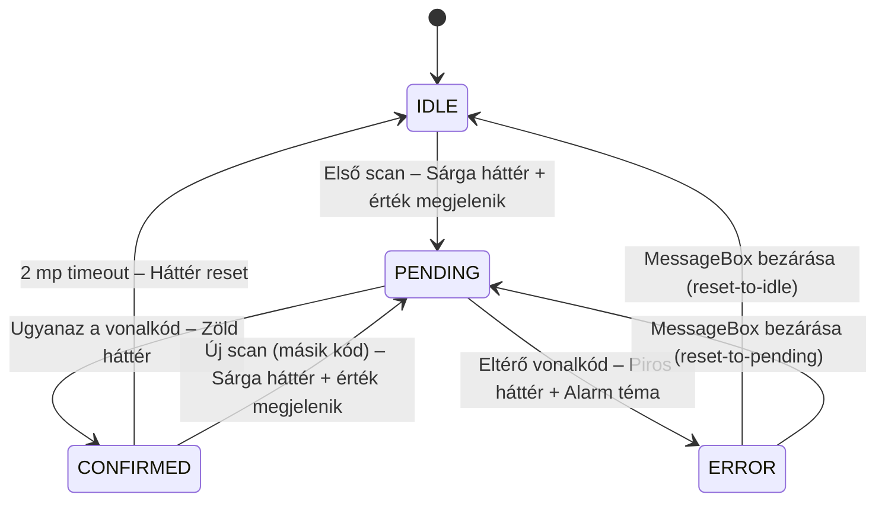

# ScanConfirmHelper — TL;DR

> Gyors referencia. Teljes verzió: [SCAN-CONFIRM-INTEGRATION-GUIDE.md](SCAN-CONFIRM-INTEGRATION-GUIDE.md)

---

## Mi ez?

Kétlépcsős vonalkód megerősítés SAPUI5-ben. Ugyanazt a kódot kell kétszer beolvasni a
művelet jóváhagyásához.



---

## Beépítés (új projektbe)

### 1. Fájl másolása

```
wms-integration/m/ScanConfirmHelper.ts  →  webapp/m/ScanConfirmHelper.ts
```

### 2. CSS hozzáfűzése → `webapp/css/style.css`

```css
.scanConfirmPending .sapMInputBaseInner { background-color: #fff3cd !important; border-color: #ffc107 !important; }
.scanConfirmOk      .sapMInputBaseInner { background-color: #d4edda !important; border-color: #28a745 !important; }
.scanConfirmError   .sapMInputBaseInner { background-color: #f8d7da !important; border-color: #dc3545 !important; }
```

### 3. Controller módosítása (4 hely)

```typescript
// a) Import
import ScanConfirmHelper from "../m/ScanConfirmHelper";

// b) Property
private _scanConfirm: ScanConfirmHelper;

// c) onInit()-ben
this._scanConfirm = new ScanConfirmHelper(this, this._applyScannedFieldValue.bind(this));

// d) Scan handler delegálása
public async onScanFieldSuccess(oEvent: Event): Promise<void> {
    await this._scanConfirm.handleScan(oEvent, "WarehouseCode", null);
}

// e) Üzleti logika callback (ez fut le CONFIRMED-kor)
private async _applyScannedFieldValue(oScanData: any, strProp: string, strChildProp: string | null): Promise<void> {
    const sValue = oScanData.text.trim();
    // ... OData update, model set, stb. ...
}
```

---

## Konfigurációs opciók

```typescript
new ScanConfirmHelper(this, this._applyScannedFieldValue.bind(this), {
    errorBehavior: "reset-to-idle",   // vagy "reset-to-pending"
    confirmResetTimeout: 2000          // ms, default: 2000
});
```

| `errorBehavior` | ERROR után | Mikor? |
|---|---|---|
| `"reset-to-idle"` *(default)* | Teljes reset, első scan is elveszik | Pl. raktárkód mező |
| `"reset-to-pending"` | Visszamegy PENDING-re, első scan megmarad | Pl. tételsor |

---

## Mező ID konvenció

A view-ban az Input ID-ja: `id="id{strProp}"` — pl. `id="idWarehouseCode"`.
A helper `byId("id" + strProp)`-pal éri el.

---

## Ellenőrző lista

- [ ] `ScanConfirmHelper.ts` → `webapp/m/`
- [ ] CSS snippet → `webapp/css/style.css`
- [ ] Controller: import, property, `new ScanConfirmHelper(...)`, scan handler, callback
- [ ] Teszt: 1. scan → sárga + érték megjelenik, 2. scan (ugyanaz) → zöld + logika, 2. scan (eltérő) → piros + alarm
