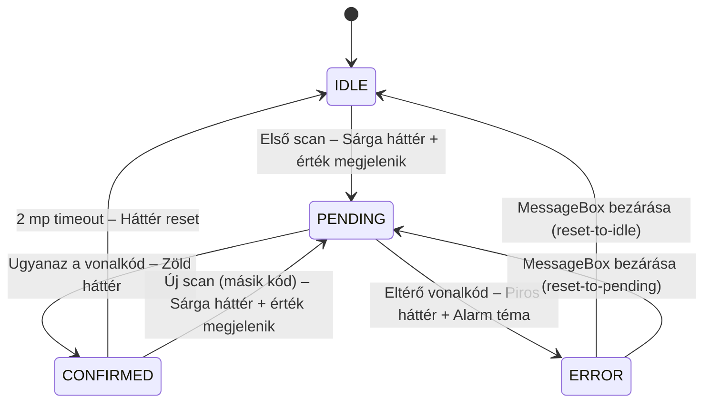

# ScanConfirmHelper — Integrációs Útmutató

Ez az útmutató leírja, hogyan kell beépíteni a kétlépcsős vonalkód megerősítés mechanizmust
egy meglévő SAPUI5/TypeScript projektbe. A WMS projektbe való beépítés tapasztalatai alapján
készült.

---

## Tartalomjegyzék

1. [Koncepció: Miért kétlépcsős megerősítés?](#koncepció-miért-kétlépcsős-megerősítés)
2. [Előfeltételek](#előfeltételek)
3. [Beépítési útmutató (setup checklist)](#beépítési-útmutató-setup-checklist)
   - [Szükséges forrásfájl](#szükséges-forrásfájl)
   - [Mappastruktúra](#mappastruktúra)
   - [CSS hozzáadása](#css-hozzáadása)
   - [Controller integrálása](#controller-integrálása)
   - [Ellenőrző lista](#ellenőrző-lista)
   - [Már integrált projektben](#már-integrált-projektben-nincs-setup)
4. [Állapotgép](#állapotgép)
5. [Konfigurációs opciók](#konfigurációs-opciók)
6. [Teljes API](#teljes-api)
7. [Példák](#példák)
   - [Alap integráció (BaseDocumentController minta)](#1-alap-integráció-basedocumentcontroller-minta)
   - [StockTransferRequest minta](#2-stocktransferrequest-minta)
   - [Több mező egymástól függetlenül](#3-több-mező-egymástól-függetlenül)
   - [errorBehavior: reset-to-pending](#4-errorbehavior-reset-to-pending)
   - [Manuális reset](#5-manuális-reset)
   - [Állapot lekérdezése](#6-állapot-lekérdezése)
8. [Mire figyelj](#mire-figyelj)
9. [Fájlok összefoglalása](#fájlok-összefoglalása)

---

## Koncepció: Miért kétlépcsős megerősítés?

Raktári (WMS) környezetben a felhasználók mobil szkennerrel dolgoznak, sokszor sietve.
Egyetlen téves vonalkód beolvasás hibás raktárhelyet, mennyiséget, vagy tételt eredményezhet.

A **kétlépcsős megerősítés** ezt akadályozza meg:

- **Első scan**: az Input mező PENDING állapotba kerül (sárga vizuális jelzés), a beolvasott
  vonalkód értéke megjelenik a mezőben, a rendszer eltárolja a kódot és várakozik a megerősítésre
- **Második scan (ugyanaz a kód)**: CONFIRMED → az üzleti logika lefut
- **Második scan (eltérő kód)**: ERROR → alarm téma + hibaüzenet, majd reset

A mechanizmus **nincs időkorláthoz kötve** PENDING állapotban — a felhasználó bármennyi
ideig ellenőrizheti a mezőt megerősítés előtt.

```
IDLE → (1. scan) → PENDING (sárga, érték megjelenik a mezőben)
                       → (ugyanaz)  → CONFIRMED (zöld) → 2s → IDLE
                       → (eltérő)   → ERROR (piros) → MessageBox bezárás → IDLE / PENDING
```

---

## Előfeltételek

- SAPUI5 1.105+ TypeScript alapú projekt
- `sap/ndc/BarcodeScanner` elérhető (NDC plugin)
- `sap/m/MessageBox` és `sap/m/MessageToast` elérhető
- A kontroller rendelkezik `byId()`, `getView()`, `getOwnerComponent()` metódussal
  (standard UI5 Controller — ez mindig teljesül)
- A `getOwnerComponent()` visszaad egy `Component`-et, amelynek van
  `getVirtualThemeManager()` metódusa (VirtualThemeManager integráció szükséges az alarm
  témához)

---

## Beépítési útmutató (setup checklist)

Ha a `ScanConfirmHelper`-t egy **meglévő kontrollerbe** akarod beépíteni ugyanabban a
projektben, csak a [Controller integrálása](#controller-integrálása) szekciót kövesd.
Ha **másik UI5 projektbe** portolod, kövesd az összes lépést.

### Szükséges forrásfájl

| Fájl | Útvonal a POC-ban | Cél |
|------|-------------------|-----|
| **ScanConfirmHelper.ts** | `wms-integration/m/ScanConfirmHelper.ts` | Állapotgép + megerősítés logika |

### Mappastruktúra

```
webapp/
├── m/
│   └── ScanConfirmHelper.ts    ← MÁSOLD IDE
├── css/
│   └── style.css               ← IDE KED A CSS SNIPPET-ET (lásd lent)
└── controller/
    └── YourController.ts       ← ITT INTEGRÁLD
```

### CSS hozzáadása

A három állapothoz tartozó stílusok a `webapp/css/style.css` fájl végéhez fűzendők:

```css
/* ─── Kétlépcsős vonalkód megerősítés állapotok ─── */
.scanConfirmPending .sapMInputBaseInner {
    background-color: #fff3cd !important;
    border-color: #ffc107 !important;
}
.scanConfirmOk .sapMInputBaseInner {
    background-color: #d4edda !important;
    border-color: #28a745 !important;
}
.scanConfirmError .sapMInputBaseInner {
    background-color: #f8d7da !important;
    border-color: #dc3545 !important;
}
```

### Controller integrálása

**4 helyen kell hozzányúlni:**

**a) Import hozzáadása** (a fájl elején):

```typescript
import ScanConfirmHelper from "../m/ScanConfirmHelper";
```

**b) Property deklarálása** (osztály szinten):

```typescript
export default class YourController extends Controller {

    // ─── Kétlépcsős vonalkód megerősítés ──────────────────────
    private _scanConfirm: ScanConfirmHelper;

    // ... többi property ...
}
```

**c) Inicializálás az `onInit()`-ben:**

```typescript
public async onInit(): Promise<void> {
    // ...
    this._scanConfirm = new ScanConfirmHelper(
        this,
        this._applyScannedFieldValue.bind(this)
        // opcionális 3. paraméter: { errorBehavior: "reset-to-pending" }
    );
    // ...
}
```

**d) Scan event handler delegálása:**

A scan gombok `liveChange` vagy `scanSuccess` event handlerét hozd létre / módosítsd:

```typescript
public async onScanFieldSuccess(oEvent: Event): Promise<void> {
    const strProp = "WarehouseCode";          // mező azonosító (byId("id" + strProp))
    const strChildProp = null;                // sor-szintű prop, ha táblázat sorban van
    await this._scanConfirm.handleScan(oEvent, strProp, strChildProp);
}
```

**e) Üzleti logika callback implementálása:**

```typescript
private async _applyScannedFieldValue(
    oScanData: any,
    strProp: string,
    strChildProp: string | null
): Promise<void> {
    // Ez fut le CONFIRMED állapotban.
    // Ide kerül az az üzleti logika, ami eddig közvetlenül a scan handlerben volt.
    const sValue = oScanData.text.trim();

    if (strProp === "WarehouseCode") {
        // pl. OData frissítés, model set, stb.
        this._oModel.setProperty("/WarehouseCode", sValue);
    }
}
```

### Ellenőrző lista

- [ ] `ScanConfirmHelper.ts` bemásolva → `webapp/m/ScanConfirmHelper.ts`
- [ ] CSS snippet hozzáfűzve → `webapp/css/style.css`
- [ ] Controller – import sor hozzáadva
- [ ] Controller – `_scanConfirm: ScanConfirmHelper` property deklarálva
- [ ] Controller – `new ScanConfirmHelper(...)` hívás az `onInit()`-ben
- [ ] Controller – `onScanFieldSuccess()` delegál a `_scanConfirm.handleScan()`-ra
- [ ] Controller – `_applyScannedFieldValue()` implementálva (üzleti logika)
- [ ] Teszt: első scan → sárga mező + érték megjelenik + toast, második (ugyanaz) → zöld + logika fut,
  második (eltérő) → piros + alarm téma + MessageBox

### Már integrált projektben (nincs setup)

Ha a projektben a `ScanConfirmHelper` már elérhető (`webapp/m/ScanConfirmHelper.ts`),
csak a kontroller módosítása szükséges — az a–e pontok.

---

## Állapotgép



**CONFIRMED állapotban újabb scan:**
A helper automatikusan resetel és új PENDING ciklust indít — nem kell külön kezelni.

**ERROR állapotban scan:**
Ignorálva — a MessageBox modális, a felhasználó előbb bezárja.

---

## Konfigurációs opciók

```typescript
new ScanConfirmHelper(ctx, applyFn, {
    errorBehavior: "reset-to-idle",   // default: "reset-to-idle"
    confirmResetTimeout: 2000          // default: 2000 ms
});
```

| Opció | Típus | Default | Leírás |
|-------|-------|---------|--------|
| `errorBehavior` | `"reset-to-idle"` \| `"reset-to-pending"` | `"reset-to-idle"` | Mi történjen ERROR után (MessageBox bezáráskor) |
| `confirmResetTimeout` | `number` | `2000` | CONFIRMED → IDLE auto-reset ideje (ms) |

### errorBehavior részletesen

- **`"reset-to-idle"`** — ERROR után teljesen nullázódik. A felhasználónak az első scan-t is
  meg kell ismételnie. Akkor jó, ha a mező értéke is törlendő hiba esetén
  *(pl. StockTransferRequest — raktárkód)*

- **`"reset-to-pending"`** — ERROR után visszamegy PENDING-re az eredeti vonalkóddal.
  A felhasználónak csak a megerősítő scant kell megismételnie.
  Akkor jó, ha az első scan-t meg akarjuk tartani *(pl. BaseDocumentController — tételsor)*

---

## Teljes API

```typescript
import ScanConfirmHelper from "../m/ScanConfirmHelper";

// Példányosítás
const helper = new ScanConfirmHelper(ctx, applyFn, options?);

// Scan event kezelése (fő belépési pont)
await helper.handleScan(oEvent, strProp, strChildProp);

// Egy mező resetelése IDLE-ra
helper.resetField("WarehouseCode");

// Összes mező resetelése IDLE-ra
helper.resetAll();

// Mező aktuális állapotának lekérdezése
const state = helper.getState("WarehouseCode");
// → "IDLE" | "PENDING" | "CONFIRMED" | "ERROR"
```

**`handleScan` paraméterei:**

| Paraméter | Típus | Leírás |
|-----------|-------|--------|
| `oEvent` | UI5 Event | A scan event objektum (`getParameters()` → `{ text, cancelled }`) |
| `strProp` | `string` | Mező azonosító — a `byId("id" + strProp)` Input-ot szólítja meg |
| `strChildProp` | `string \| null` | Sor-szintű property neve táblázat sorokban; egyszerű mezőknél `null` |

---

## Példák

### 1. Alap integráció (BaseDocumentController minta)

```typescript
import ScanConfirmHelper from "../m/ScanConfirmHelper";

export default class PickListDetails extends BaseDocumentController {

    private _scanConfirm: ScanConfirmHelper;

    public async onInit(): Promise<void> {
        await super.onInit();

        this._scanConfirm = new ScanConfirmHelper(
            this,
            this._applyScannedFieldValue.bind(this),
            { errorBehavior: "reset-to-pending" }
        );
    }

    public async onScanFieldSuccess(oEvent: Event): Promise<void> {
        await this._scanConfirm.handleScan(oEvent, "BinCode", "BinCode");
    }

    private async _applyScannedFieldValue(
        oScanData: any,
        strProp: string,
        strChildProp: string | null
    ): Promise<void> {
        const sCode = oScanData.text.trim();
        // ... OData update, model set, stb. ...
    }
}
```

### 2. StockTransferRequest minta

```typescript
this._scanConfirm = new ScanConfirmHelper(
    this,
    this._applyScannedFieldValue.bind(this)
    // errorBehavior default: "reset-to-idle"
);

// Két különböző mezőhöz, mindkettő független állapotgéppel:
public async onFromWareHouseScanSuccess(oEvent: Event): Promise<void> {
    await this._scanConfirm.handleScan(oEvent, "FromWarehouse", null);
}

public async onToWareHouseScanSuccess(oEvent: Event): Promise<void> {
    await this._scanConfirm.handleScan(oEvent, "ToWarehouse", null);
}
```

### 3. Több mező egymástól függetlenül

Egy `ScanConfirmHelper` példány **tetszőleges számú mezőt** kezel — minden mező saját
`FieldState`-tel rendelkezik, az állapotgépek egymástól teljesen függetlenek:

```typescript
// onInit()-ben egyszer:
this._scanConfirm = new ScanConfirmHelper(this, this._applyScannedFieldValue.bind(this));

// Különböző scan handlerek, különböző strProp értékkel:
public async onFromWarehouseScan(oEvent: Event): Promise<void> {
    await this._scanConfirm.handleScan(oEvent, "FromWarehouse", null);
}
public async onToWarehouseScan(oEvent: Event): Promise<void> {
    await this._scanConfirm.handleScan(oEvent, "ToWarehouse", null);
}
public async onBinCodeScan(oEvent: Event): Promise<void> {
    await this._scanConfirm.handleScan(oEvent, "BinCode", null);
}
```

### 4. errorBehavior: reset-to-pending

```typescript
// Tételsor biztonságos scan — hiba esetén az eredeti kód marad PENDING-ben,
// csak a megerősítő scant kell megismételni:
this._scanConfirm = new ScanConfirmHelper(
    this,
    this._applyScannedFieldValue.bind(this),
    { errorBehavior: "reset-to-pending" }
);
```

### 5. Manuális reset

```typescript
// Pl. "Mégse" gombra vagy dialog bezáráskor:
public onCancelDialog(): void {
    this._scanConfirm.resetAll();
    // ...
}

// Vagy csak egy mezőt:
public onClearWarehouse(): void {
    this._scanConfirm.resetField("FromWarehouse");
}
```

### 6. Állapot lekérdezése

```typescript
// Pl. Submit gomb engedélyezése csak ha mindkét mező CONFIRMED:
private _isReadyToSubmit(): boolean {
    return (
        this._scanConfirm.getState("FromWarehouse") === "CONFIRMED" &&
        this._scanConfirm.getState("ToWarehouse") === "CONFIRMED"
    );
}
```

---

## Mire figyelj

1. **A mező ID-ja `"id" + strProp` formátumú kell legyen a view-ban** — a helper
   `byId("id" + strProp)`-pal keresi meg az Input kontrollert. Ha más az ID konvenció,
   a `_setScanFieldVisual()` nem fog szólni, de az állapotgép ettől még működik.

2. **Az `_applyScannedFieldValue` callback async** — ha egy OData hívás hibát dob,
   a helper elkapja, reseteli a mezőt és `MessageBox.error`-t mutat. Nem kell külön
   try/catch a callbackbe.

3. **A VirtualThemeManager szükséges** az alarm témához — a helper
   `getOwnerComponent().getVirtualThemeManager().switchTheme("alarm")` hívást végez
   ERROR esetén. Ha a projektben nincs VTM, a `ScanConfirmHelper.ts`-ben ezt a két
   sort kell kikommentezni / eltávolítani.

4. **Nincs időkorlát PENDING állapotban** — szándékos. A raktári felhasználó
   ellenőrizheti a mezőt megerősítés előtt.

5. **ERROR állapotban a scan ignorálva van** — amíg a MessageBox nyitva van, új
   scan nem indíthat új ciklust. MessageBox bezárás után a `errorBehavior` dönti el
   az állapotot.

6. **`confirmResetTimeout` csak CONFIRMED → IDLE átmenetre vonatkozik** — a CONFIRMED
   állapot 2 másodperc után automatikusan IDLE-ra vált, de az üzleti logika (`_applyFn`)
   már lefutott a CONFIRMED belépésekor.

---

## Fájlok összefoglalása

| Fájl | Művelet | Leírás |
|------|---------|--------|
| `webapp/m/ScanConfirmHelper.ts` | **ÚJ** | Állapotgép + megerősítés logika |
| `webapp/css/style.css` | **MÓDOSÍTÁS** | +12 sor CSS (3 állapot stílus) |
| `webapp/controller/YourController.ts` | **MÓDOSÍTÁS** | import, property, onInit, handler, callback |

A `Component.ts` és `manifest.json` **NEM módosul** — a helper önálló, nem igényel
Component-szintű inicializálást.
