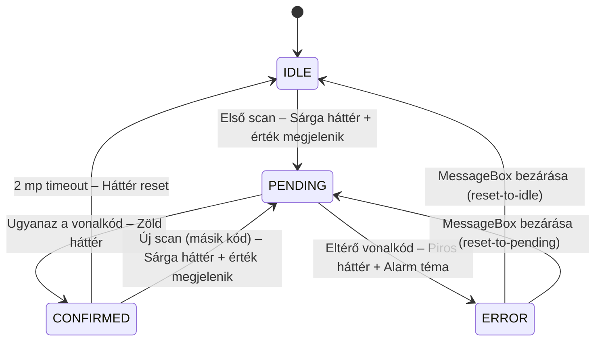
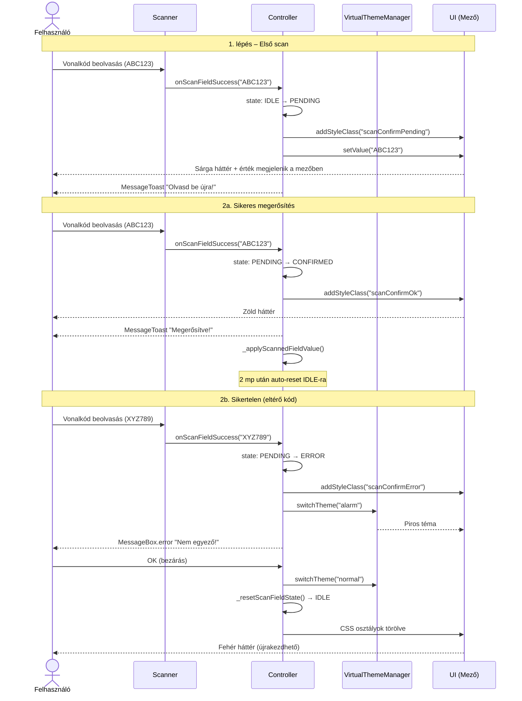

# ScanConfirmHelper — Használati Segédlet

> A ScanConfirmHelper már be van építve a projektbe. Ez a dokumentum a napi használathoz
> szükséges tudnivalókat tartalmazza.
> Beépítéshez / portoláshoz lásd: [SCAN-CONFIRM-INTEGRATION-GUIDE.md](SCAN-CONFIRM-INTEGRATION-GUIDE.md)

---

## Hogyan működik

Egy kontrollerben a `ScanConfirmHelper` példány kezeli a vonalkód scan eventeket.
Minden mező saját független állapotgéppel rendelkezik:



ERROR esetén `MessageBox.error` jelenik meg. Bezáráskor a viselkedés a konfigurációtól függ:
- `"reset-to-idle"` → teljesen nullázódik (első scan is elveszik)
- `"reset-to-pending"` → visszamegy PENDING-re (első scan megmarad)

### Szekvencia diagram



---

## Hozzáférés

A helper a kontroller `onInit()`-jében lett példányosítva:

```typescript
// A kontrollerben már elérhető:
this._scanConfirm   // ScanConfirmHelper példány
```

Új kontrollerben (ahol még nincs beállítva):

```typescript
import ScanConfirmHelper from "../m/ScanConfirmHelper";

private _scanConfirm: ScanConfirmHelper;

public async onInit(): Promise<void> {
    // ...
    this._scanConfirm = new ScanConfirmHelper(this, this._applyScannedFieldValue.bind(this));
}
```

---

## API gyorsreferencia

```typescript
// Scan event kezelése (fő belépési pont)
await this._scanConfirm.handleScan(oEvent, strProp, strChildProp);

// Állapot lekérdezése
this._scanConfirm.getState("WarehouseCode");
// → "IDLE" | "PENDING" | "CONFIRMED" | "ERROR"

// Egy mező resetelése
this._scanConfirm.resetField("WarehouseCode");

// Összes mező resetelése
this._scanConfirm.resetAll();
```

---

## Példák

### Alap scan handler

Minden scan gombhoz egy handler tartozik, ami `handleScan()`-ra delegál:

```typescript
public async onWarehouseScanSuccess(oEvent: Event): Promise<void> {
    await this._scanConfirm.handleScan(oEvent, "WarehouseCode", null);
}
```

A `strProp` értéke meghatározza:
1. Melyik `FieldState` (állapotgép) aktiválódik
2. Melyik Input kontrol kap vizuális jelzést: `byId("id" + strProp)` → pl. `idWarehouseCode`
3. Milyen `strProp` értékkel hívódik meg a `_applyScannedFieldValue` callback

### Táblázat sor mezőjének scannelése

Ha a mező egy táblázat sorában van (pl. tételsor mennyisége), a `strChildProp` adja meg
a sor-szintű property nevét:

```typescript
public async onLineBinCodeScan(oEvent: Event): Promise<void> {
    // strProp: a mező azonosítója (byId)
    // strChildProp: a sor-szintű property neve (pl. binding path)
    await this._scanConfirm.handleScan(oEvent, "LineBinCode", "BinCode");
}
```

### Több mező egymástól függetlenül

Ugyanaz a helper példány több mezőt is kezel — az állapotgépek teljesen függetlenek:

```typescript
public async onFromWarehouseScan(oEvent: Event): Promise<void> {
    await this._scanConfirm.handleScan(oEvent, "FromWarehouse", null);
}

public async onToWarehouseScan(oEvent: Event): Promise<void> {
    await this._scanConfirm.handleScan(oEvent, "ToWarehouse", null);
}
```

Az első mező PENDING-ben lehet, miközben a másodikhoz az első scan történik — nem zavarják egymást.

### Manuális reset (Mégse / dialog bezárás)

```typescript
public onCancelDialog(): void {
    this._scanConfirm.resetAll();   // minden mező → IDLE
    this._dialog.close();
}

public onClearFromWarehouse(): void {
    this._scanConfirm.resetField("FromWarehouse");   // csak ez a mező → IDLE
}
```

### Állapot alapú UI logika

```typescript
// Submit gomb engedélyezése csak ha mindkét mező CONFIRMED:
private _updateSubmitButton(): void {
    const bEnabled =
        this._scanConfirm.getState("FromWarehouse") === "CONFIRMED" &&
        this._scanConfirm.getState("ToWarehouse")   === "CONFIRMED";

    (this.byId("btnSubmit") as Button).setEnabled(bEnabled);
}
```

### errorBehavior váltása

Ha azt szeretnéd, hogy hiba esetén az első scan megmaradjon (a felhasználónak csak a
megerősítő scant kell megismételnie):

```typescript
this._scanConfirm = new ScanConfirmHelper(
    this,
    this._applyScannedFieldValue.bind(this),
    { errorBehavior: "reset-to-pending" }
);
```

---

## A callback: `_applyScannedFieldValue`

Ez a metódus fut le, amikor a felhasználó sikeresen megerősítette a scan-t (CONFIRMED állapot).
Ide kerül az üzleti logika — ugyanaz, ami korábban közvetlenül a scan handlerben volt:

```typescript
private async _applyScannedFieldValue(
    oScanData: any,
    strProp: string,
    strChildProp: string | null
): Promise<void> {
    const sValue = oScanData.text.trim();

    switch (strProp) {
        case "FromWarehouse":
            await this._loadWarehouses(sValue);
            break;
        case "ToWarehouse":
            this._oModel.setProperty("/ToWarehouse", sValue);
            break;
        case "LineBinCode":
            await this._updateLineBinCode(sValue, strChildProp);
            break;
    }
}
```

Ha a callback hibát dob (pl. OData hiba), a helper automatikusan:
- reseteli a mezőt IDLE-ra
- `MessageBox.error`-t mutat a hiba üzenetével

Nem szükséges try/catch a callbackbe — hacsak nem akarsz speciális hibakezelést.

---

## Vizuális állapotok

| Állapot | Input mező megjelenése | Jelentés |
|---------|----------------------|----------|
| `IDLE` | Normál | Várakozik az első scanre |
| `PENDING` | Sárga háttér, amber keret, beolvasott érték megjelenik | Első scan megvolt, megerősítés szükséges |
| `CONFIRMED` | Zöld háttér, zöld keret | Sikeres megerősítés, logika lefutott |
| `ERROR` | Piros háttér, piros keret + alarm téma | Eltérő kód scannelve |

A vizuális jelzés az Input kontrol CSS class-án keresztül működik:
`scanConfirmPending` / `scanConfirmOk` / `scanConfirmError`

---

## Tudnivalók

1. **Nincs időkorlát PENDING-ben** — a felhasználó bármennyi ideig ellenőrizheti a mezőt
   megerősítés előtt. Ez szándékos.

2. **A CONFIRMED auto-reset 2 mp után történik** — de az üzleti logika már a CONFIRMED
   belépésekor lefutott. A 2 mp csak a vizuális visszajelzés ideje.

3. **ERROR állapotban a scan ignorálva** — amíg a MessageBox nyitva van, újabb scan nem
   indít új ciklust.

4. **CONFIRMED állapotban újabb scan** — a helper automatikusan új PENDING ciklust indít,
   nem kell külön kezelni.

5. **Mező ID konvenció** — a `byId("id" + strProp)` hívás miatt a view-ban az Input
   azonosítója `id="id{strProp}"` formátumú kell legyen (pl. `id="idFromWarehouse"`).
   Ha a vizuális jelzés nem jelenik meg, de az állapotgép működik, valószínűleg eltérő az ID.

6. **Egy helper, több mező** — nem kell mező-nként külön `ScanConfirmHelper`-t létrehozni.
   Egy példány tetszőleges számú mezőt kezel.
